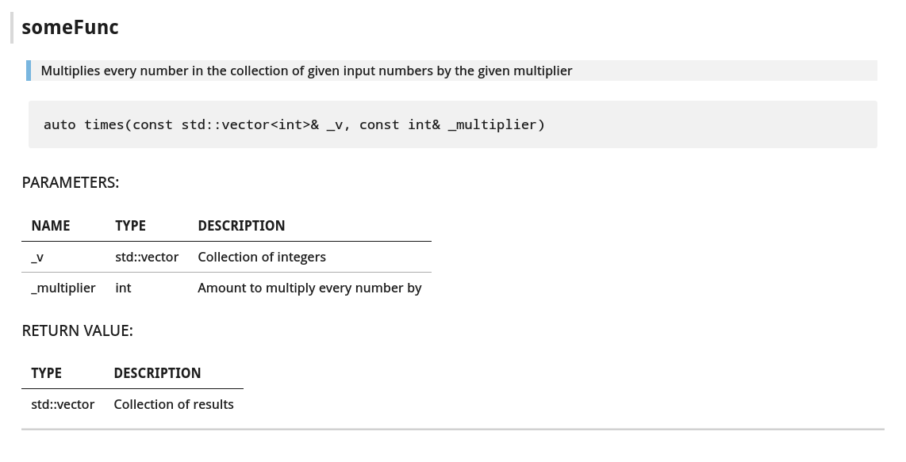

## Cpp Doc Generator

A cpp documentation generator written in python3 which parses the cpp source files for comments written in this format :fax: :pencil: :

### Format Example:
```
/**
    * @method <method name>
    * @access <access specifier>
    * @desc <multi/single line description>
    *
    * @param {<param1 type>} <param1 name> <param1 description (multi/single line)>
    * @param {<param2 type>} <param2 name> <param2 description (multi/single line)>
    * @returns {<return type>} <return value description(multi/single line)>
*/

```

Supported tags are `@method`, `@access`, `@desc`, `@param`, `@returns`, `@namespace`, `@class`, `@construct`.

### Usage:

```
cd cpp_doc_generation

./cpp_doc_generator -f <cpp_source_file.cpp> <cpp_source_file.hpp> .... -d <destination_dir>
```
 *Note that by default the destination directory is your **current working directory***

 Markdown for each source file will be generated in the given destination directory **(*default: current working directory*)** by the name: `source_file.md`

### Example:

```
// example.cpp

#include <iostream>
#include <vector>

/**
    * @function someFunc
    * @desc Multiplies every number in the collection of given input numbers by
    * the given multiplier
    *
    * @param {std::vector<int>} _v Collection of integers
    * @param {int} _multiplier Amount to multiply every number by
    * @returns {std::vector<int>} Collection of results
*/
auto times(const std::vector<int>& _v, const int& _multiplier){
    
    std::vector<int> res;

    for(auto &x: _v){
        res.push_back(x * _multiplier);
    }

    return res;
}

int main(){

    std::vector<int> my_vec{4, 6, 8, 2, 1};

    auto twice = times(my_vec, 2);
    std::cout << "Double of my_vec:";
    for (auto &x: twice){
        std::cout << ' ' << x;
    }

    std::cout << '\n';

    auto thrice = times(my_vec, 3);
    std::cout << "Thrice of my_vec:";
    for (auto &x: thrice){
        std::cout << ' ' << x;
    }

    return 0;
}
```

Running cpp doc generator on the above example.cpp like this:
```
./cpp_doc_generator.py -f example.cpp
```

Markdown generated file `example.md` is:
~~~
## **someFunc**

>Multiplies every number in the collection of given input numbers by the given multiplier
```
auto times(const std::vector<int>& _v, const int& _multiplier)
```
### PARAMETERS:
| NAME | TYPE | DESCRIPTION |
|------ | ------ | -------------|
|_v|std::vector<int>|Collection of integers|
|_multiplier|int|Amount to multiply every number by|

### RETURN VALUE:
|TYPE | DESCRIPTION |
|------|-------------|
|std::vector<int>|Collection of results|

___
~~~

Which renders like this:



*Support of `@throws` tag coming soon*